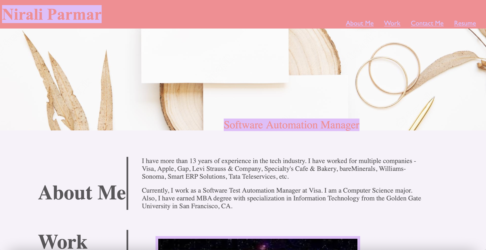

# challenge-jun-27

##Description

In this challenge, I have developed my portfolio website. This website has html and css codes that do the following:

- It has a header with my name highlighted.

- It has a navigation bar with the links that jump to the sections 'About Me', 'Work', and 'Contact Me' on the page. It also has a link to my resume/LinkedIn profile page.

- It has a cover picture with my current job title highlighted.

- It has "About Me" section with my portfolio description.

- It has "Work" section with the picture links to my github public projects.

- It has the footer "Contact Me" section with working links to my contact number, email address, Github profile, Twitter profile link, and Spotify profile link.

- The links on the navigation bar and the footer section gets highlighted on hover and changes the color. Also, the images on the "Work" section gets highlighted and changes the color of the border.

- The website is responsive to the window size change and changes the color of the navigation bar and the links on the navigation bar.

- The "Work" section shows the images horizontal when the window size is decreased.

